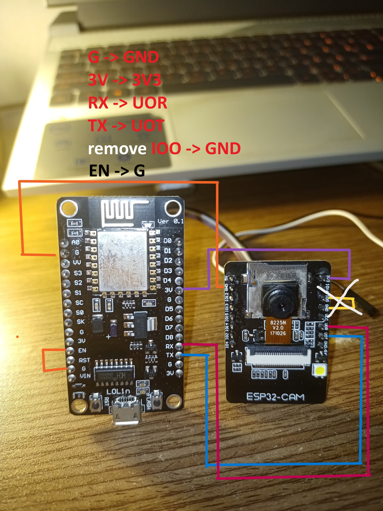
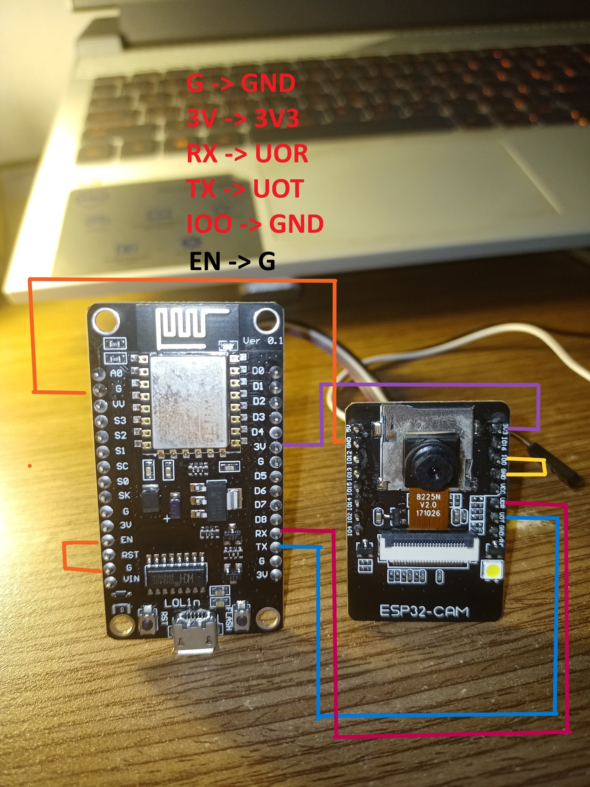
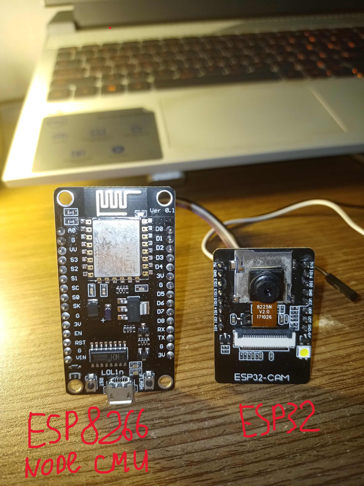

## HƯỚNG DẪN CẤU HÌNH ARDUINO IDE VÀ NẠP CODE CHO ESP32-CAM THÔNG QUA ESP8266

1. Mở tệp `ESP32CAM.ino`.

2. Bật model camera tương ứng bằng cách bỏ comment và tắt các model còn lại, ví dụ: `#define CAMERA_MODEL_AI_THINKER`.

3. Nhập thông tin wifi:

    ```cpp
    const char* ssid = "YOUR_WIFI_SSID";
    const char* password = "YOUR_WIFI_PASSWORD";
    ```

4. Nhập thông tin server:

    ```cpp
    String serverName = "YOUR_SERVER_IP_ADDRESS";
    const int serverPort = YOUR_SERVER_PORT;
    String serverPath = "/upload";
    String fileName = "ESP32-001";
    ```

5. Nạp code cho ESP32-CAM sử dụng ESP8266.
    
    **<span style="color: red; font-weight: bold">Đây là hướng dẫn cho trường hợp sử dụng ESP8266 NodeMcu thay cho cổng USB trên mạch ESP32-CAM hoặc thay cho mạch USB chuyên dụng của ESP32-CAM.</span>**
  
   **Bước 1:** Kết nối mạch với máy tính thông qua ESP8266 và cáp USB:

   
    `Sơ đồ kết nối dây`
    ```
        | ESP8266 pin | ESP32-CAM pin                                      |
        |-------------|----------------------------------------------------|
        | G           | GND                                                |
        | 3V          | 3V3                                                |
        | RX          | UOR                                                |
        | TX          | UOT                                                |
        | IO0         | GND                                                |
        | EN          | G (trên mạch esp8266 để tránh khởi động mạch này)  |
    ```

    <!-- | ESP8266 pin | ESP32-CAM pin                  |
    |-------------|--------------------------------|
    |   |                                                 |
    -->

    |Original|Diagram upload code|Diagram run code|
    |-|-|-|
    | | | |

    <!-- 
    
     -->

   **Bước 2:**
   - Mở Arduino IDE.
   - Chọn cấu hình Arduino như hướng dẫn bên dưới.
   - Nhấn nút Upload để nạp code cho ESP32-CAM.
   - <mark>Lưu ý:</mark> trước khi IDE chuyển sang chế độ nạp code, nhấn giữ nút reset trên mạch ESP32-CAM cho đến khi IDE hiển thị "Uploading..." thì thả tay ra.

6. Nhấn nút reset trên mạch để khởi động mạch.

## CẤU HÌNH ARDUINO IDE

Nếu sử dụng model AI_THINKER, hãy cấu hình Arduino IDE như sau:

- Board: "AI Thinker ESP-32 CAM"
- Port: "COMX"
- CPU Frequency: "240MHz (WiFi/BT)"
- Flash Frequency: "80MHz"
- Flash Mode: "DIO"
- Partition Scheme: "Huge APP (3MB No OTA/1MB SPIFFS)"
