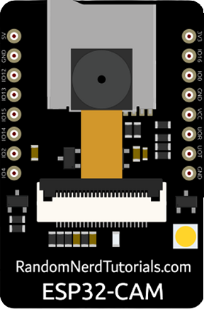
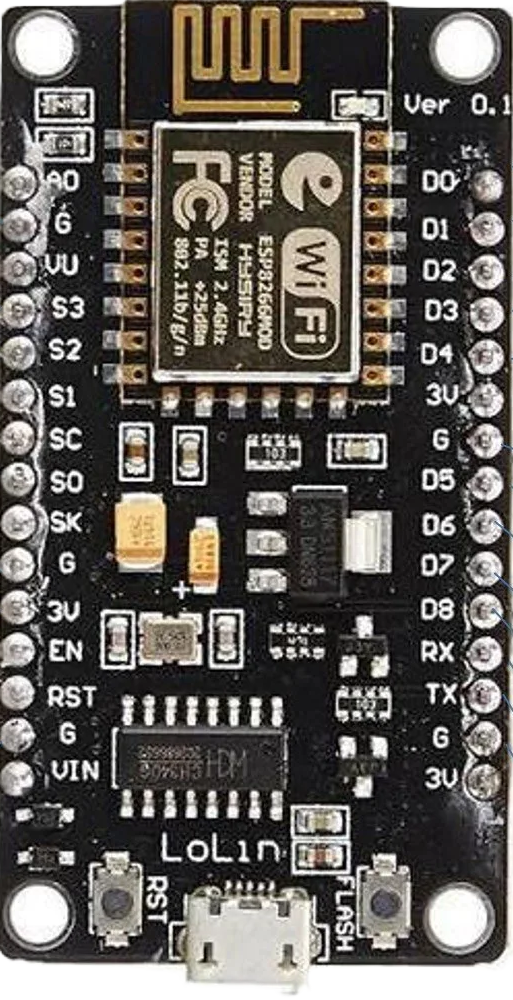
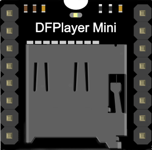
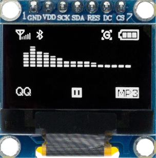
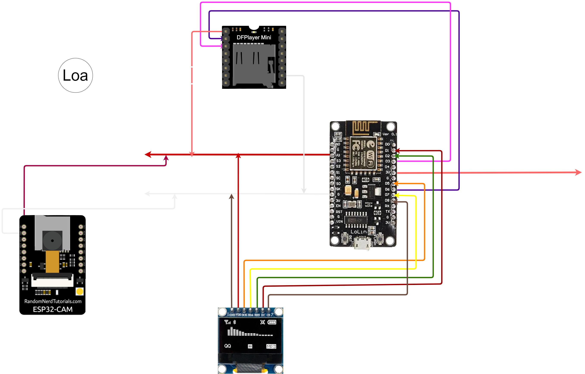
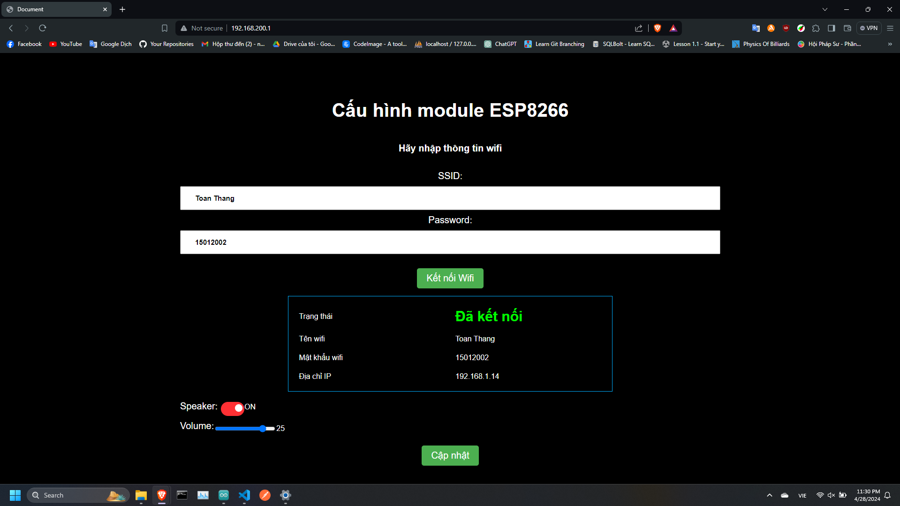
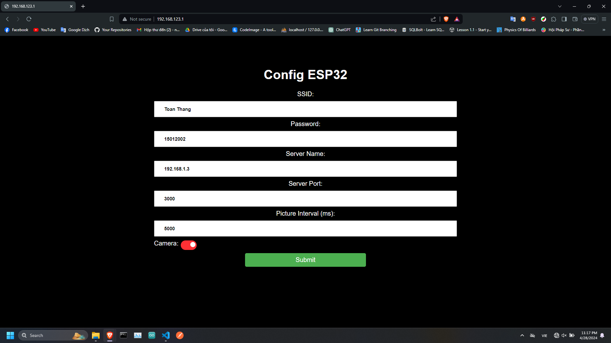

# **Hệ Thống Điểm Danh Bằng Nhận Diện Khuôn Mặt**

**[1. Mục tiêu](#1-mục-tiêu)**
<br>
**[2. Công nghệ sử dụng](#2-công-nghệ-sử-dụng)**
<br>
**&nbsp;&nbsp;&nbsp;&nbsp;&nbsp;&nbsp;[2.1. Phần cứng](#21-phần-cứng)**
<br>
**&nbsp;&nbsp;&nbsp;&nbsp;&nbsp;&nbsp;[2.2. Phần mềm, Framework và Ngôn ngữ lập trình](#22-phần-mềm-framework-và-ngôn-ngữ-lập-trình)**
<br>
**[3. Cách cấu hình hệ thống](#3-cách-cấu-hình-hệ-thống)**
<br>
**&nbsp;&nbsp;&nbsp;&nbsp;&nbsp;&nbsp;[3.1. Sơ đồ kết nối](#31-sơ-đồ-kết-nối)**
<br>
**&nbsp;&nbsp;&nbsp;&nbsp;&nbsp;&nbsp;[3.2. Quy trình khởi động hệ thống](#32-quy-trình-khởi-động-hệ-thống)**
<br>
**&nbsp;&nbsp;&nbsp;&nbsp;&nbsp;&nbsp;&nbsp;&nbsp;&nbsp;&nbsp;[NOTE Lưu ý](#note-chú-ý-esp8266-esp32-nodejs-server-và-python-server-phải-kết-nối-chung-wifi)**
<br>
**&nbsp;&nbsp;&nbsp;&nbsp;&nbsp;&nbsp;[3.3. Cách cấu hình server ESP32-CAM và ESP8266 NodeMcu](#33-cách-cấu-hình-server-esp32-cam-và-esp8266-nodemcu)**
<br>
**&nbsp;&nbsp;&nbsp;&nbsp;&nbsp;&nbsp;&nbsp;&nbsp;&nbsp;&nbsp;[3.3.1. Cấu hình server ESP32-CAM](#331-cấu-hình-server-esp32-cam)**
<br>
**&nbsp;&nbsp;&nbsp;&nbsp;&nbsp;&nbsp;&nbsp;&nbsp;&nbsp;&nbsp;[3.3.2. Cấu hình server ESP8266 NodeMcu](#332-cấu-hình-server-esp8266-nodemcu)**
<br>
**&nbsp;&nbsp;&nbsp;&nbsp;&nbsp;&nbsp;[3.4. Hình ảnh](#34-hình-ảnh)**


## 1. Mục Tiêu

-   Xây dựng hệ thống điểm danh bằng nhận diện khuôn mặt.
-   Sử dụng mạch ESP32-CAM và mạch ESP8266 NodeMcu.
-   Sử dụng công nghệ nhận diện khuôn mặt phát triển bằng ngôn ngữ Python.

## 2. Công nghệ sử dụng

### 2.1. Phần cứng

| ESP32-CAM                                                                | ESP8266 NodeMcu                                                        | DFPlayer Mini                                                           | Loa                                                                                                                | Màn OLED                                                                   |
| ------------------------------------------------------------------------ | ---------------------------------------------------------------------- | ----------------------------------------------------------------------- | ------------------------------------------------------------------------------------------------------------------ | -------------------------------------------------------------------------- |
| Chụp ảnh và gửi ảnh lên server                                           | Kết nối mạch với máy tính để nạp code cho ESP32-CAM                    | Module giải mã âm thanh                                                 | Phát âm thanh thông báo                                                                                            | Hiển thị thông tin điểm danh                                               |
|  |  |  |  |  |
---
### 2.2. Phần mềm, Framework và Ngôn ngữ lập trình

| Tên                        | Chức năng                                                          |
| -------------------------- | ------------------------------------------------------------------ |
| Arduino IDE                | Môi trường lập trình cho ESP32-CAM và ESP8266 NodeMcu              |
| Ngôn ngữ lập trình Arduino | Tương tự C/C++. Dùng để lập trình cho ESP32-CAM và ESP8266 NodeMcu |
---

## 3. Cách cấu hình hệ thống

### 3.1. Sơ đồ kết nối



### 3.2. Quy trình khởi động hệ thống

-   Bước 1: Kết nối các phần cứng theo sơ đồ.
-   Bước 2: Cấp nguồn cho hệ thống phần cứng.
-   Bước 3: Khởi động hệ quản trị cơ sở dữ liệu MySQL. Dự án sử dụng **XAMPP** để quản trị cơ sở dữ liệu.
-   Bước 4: Khởi động server NodeJS.
-   Bước 5: Khởi động server Python.
-   Bước 6: Khởi động lại hệ thống phần cứng.
-   Bước 7: Truy cập trang web cấu hình server ESP32-CAM và ESP8266 NodeMcu.
-   Bước 8: Cấu hình server ESP32-CAM và ESP8266 NodeMcu.

  <span style="color:red; font-size:20px; font-weight:bold"></span>
  <br>
  <span style="color:red; font-size:20px; font-weight:bold"></span>

```diff
 Chú ý: ESP8266, ESP32, Nodejs server và Python server phải kết nối chung WiFi
 Chú ý xác định đúng IPV4 các server
```

### 3.3. Cách cấu hình server ESP32-CAM và ESP8266 NodeMcu
#### 3.3.1. Cấu hình server ESP32-CAM
1. Kết nối mạng wifi
    - Tên wifi
    ```cpp
    ESP32-AP
    ```
    - Mật khẩu wifi
    ```cpp
    Hãy để trống
    ```
2. Truy cập trang web cấu hình server
    - Địa chỉ
    ```cpp
    http://192.168.123.1/
    ```
#### 3.3.2. Cấu hình server ESP8266 NodeMcu
1. Kết nối mạng wifi
    - Tên wifi
    ```cpp
    ESP8266 WiFi
    ```
    - Mật khẩu wifi
    ```cpp
    Hãy để trống
    ```
2. Truy cập trang web cấu hình server
    - Địa chỉ
    ```cpp
    http://192.168.200.1/
    ```
### 3.4. Hình ảnh
| ESP8266 Server Site                                                                    | ESP32-CAM Server Site                                                                    |
| -------------------------------------------------------------------------------------- | ---------------------------------------------------------------------------------------- |
|  |  |


